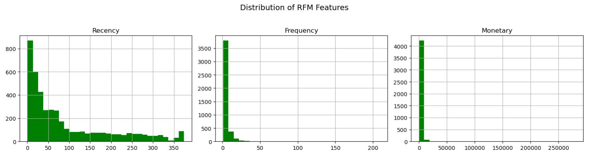
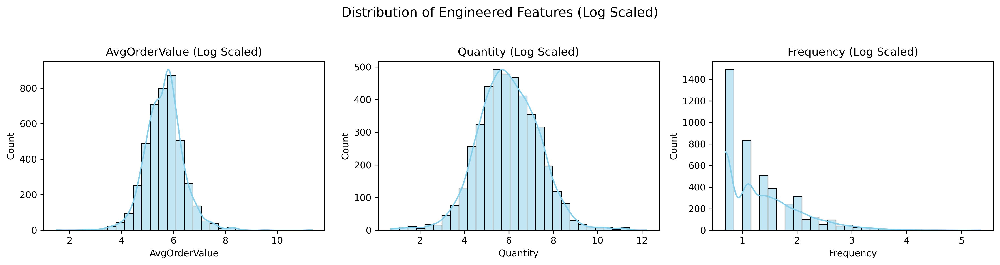
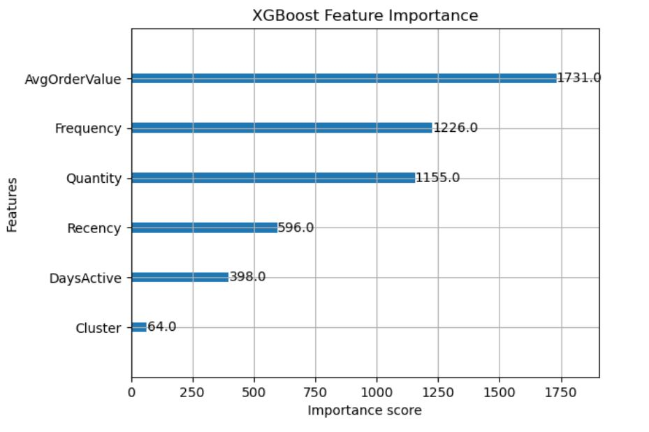
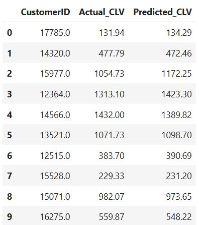
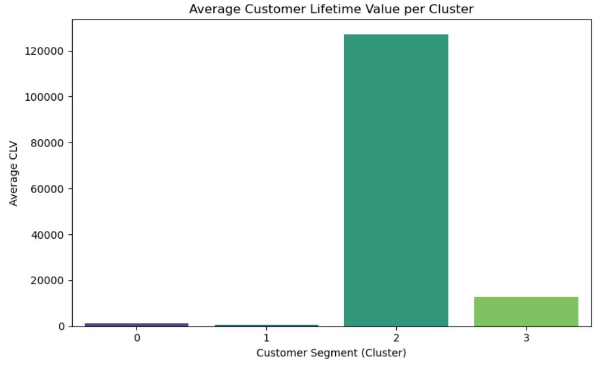
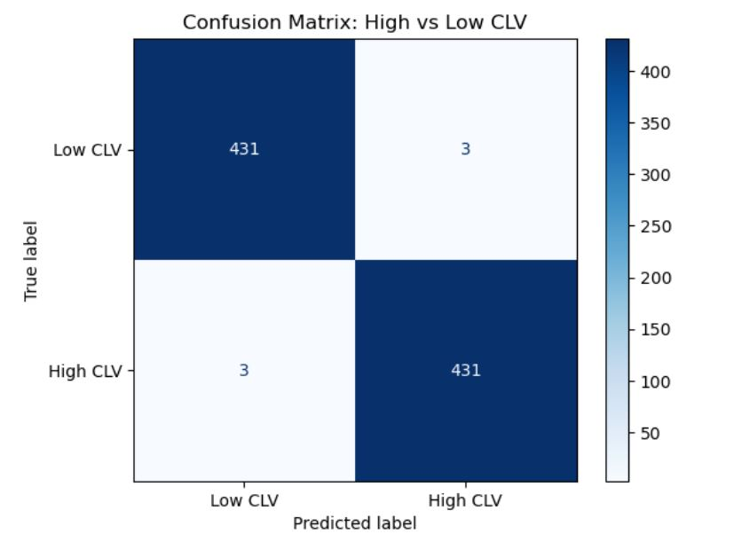

# Customer Segmentation & Lifetime Value Prediction

In this project, I applied RFM segmentation and machine learning to predict Customer Lifetime Value (CLV) based on customer sales data from the UCI Online Retail dataset. It also includes a Streamlit app for real-time prediction.

---

## Project Structure

- `1_eda.ipynb` – Data cleaning, EDA, and initial exploration  
- `2_segmentation.ipynb` – RFM feature creation, KMeans clustering  
- `3_ltv_prediction.ipynb` – CLV modeling using XGBoost  
- `clv_predictor_form_app.py` – Manual-input Streamlit app for real-time CLV prediction  
- `xgb_clv_model.pkl` – Trained XGBoost model (log-transformed target)

---

## Dataset

- **Source**: [UCI Online Retail Dataset](https://archive.ics.uci.edu/ml/datasets/online+retail)  
- Contains ~500,000 transactions for a UK-based online retailer from 2010–2011

---

## Features Used for CLV Prediction

All features used in the model were engineered from raw transactional data to reflect customer behavior:

- **Recency**: Days since the customer’s most recent purchase
- **Frequency**: Number of unique purchases made
- **Cluster**: Customer segment from KMeans clustering (based on RFM)
- **AvgOrderValue**: Average order size, calculated as `Monetary / Frequency`
- **DaysActive**: Number of days between first and last purchase
- **Quantity**: Total number of items purchased

These features were created to capture behavioral patterns and spending habits, which greatly improved model performance.

---

## Model Overview

- **Algorithm**: XGBoost Regressor  
- **Target**: Log-transformed Monetary (CLV), inverse transformed with `np.expm1()`  
- **Performance**:  
  - RMSE: ~4000  
  - R²: 0.84
    
## Visualizations & Insights

### 1. Distribution of RFM Features


This chart shows the raw distributions of **Recency**, **Frequency**, and **Monetary**. Most customers made recent purchases (low Recency), purchased infrequently (low Frequency), and spent relatively little (low Monetary). These right-skewed patterns justify segmentation and modeling.

---

### 2. Distribution of Engineered Features (Log Scaled)


I engineered features such as **AvgOrderValue**, **DaysActive**, and **Quantity** to improve model performance. After log transformation, the distributions are more normalized, which helps the model better capture behavioral patterns and reduce the impact of outliers.

---

### 3. XGBoost Feature Importance


This plot shows which features contributed most to predicting CLV.  
- **AvgOrderValue** and **Frequency** were the strongest predictors.  
- **Cluster** had minimal influence, confirming that behavioral features are more powerful than segmentation alone.

---

### 4. Actual vs Predicted CLV (Sample Table)


A sample comparison of actual vs. predicted customer lifetime value. Most predictions closely align with actual values, reinforcing the model's efficiency. These outputs can help a business identify undervalued customers with potential long-term value.

---

### 5. Average CLV by Cluster


This bar chart displays the average CLV across customer clusters.  
**Cluster 2** contains the highest-value customers.

---

### 6. Confusion Matrix – High vs Low CLV


I converted CLV into binary classes (high vs low, based on the median) and used a confusion matrix to evaluate accuracy.  
The model correctly classified **~99%** of customers.

---

## Results & Actionable Insights

### Model Performance

- **Model**: XGBoost Regressor  
- **Target**: Customer Lifetime Value (log-transformed, inverse with `expm1`)  
- **R² Score**: 0.84  
- **RMSE**: ~$4,000  

The model explains 84% of the variation in customer lifetime value, which is promising for behavioral data. This shows that the engineered features capture meaningful customer spending behavior.

---

### Key Findings

- `AvgOrderValue` was the strongest predictor of CLV, showing that customers who spend more per transaction greatly contribute to overall value.
- `Frequency` and `Quantity` were also highly influential, showing that both purchase regularity and volume increase customer lifetime value.
- `Recency` and `DaysActive` had moderate importance, which suggests that time-based behaviors are helpful but secondary to spending patterns.
- `Cluster` had the lowest impact, reinforcing that behavioral features (spending and purchase patterns) are more predictive than assigned segment labels.
- Customers in **Cluster 2** were consistently high-value, validating the segmentation logic for targeting.

---

### Actionable Business Insights

1. **Target customers with high AvgOrderValue for premium offers or early access promotions** — these customers are the strongest drivers of long-term revenue and likely respond well to high-value incentives.

2. **Focus retention efforts on customers with high Frequency and Quantity** — frequent buyers who also purchase in larger volumes are highly profitable and are worth retaining through loyalty programs or subscriptions.

3. **Use Recency and DaysActive to identify at-risk customers or re-engagement opportunities** — customers who have not purchased recently but were active over a long time span may be revived with personalized offers.

4. **Monitor Cluster 2 customers** — these customers consistently show a high lifetime value. Consider offering exclusive rewards or upsell campaigns tailored to this group.

5. **Don’t rely solely on segment labels (Cluster)** — while helpful for broad strategies, behavioral metrics like AvgOrderValue and Frequency are more precise for targeting.

---

## Streamlit App
Click [Here](https://customer-segmentation-and-clv-kcs4cscwrzgvvyjgzsf64l.streamlit.app/) for the web app
### `clv_predictor_form_app.py`
- Allows user to enter Recency, Frequency, Cluster, etc.  
- Predicts CLV instantly using the trained model  

To run locally:
```bash
streamlit run clv_predictor_form_app.py
